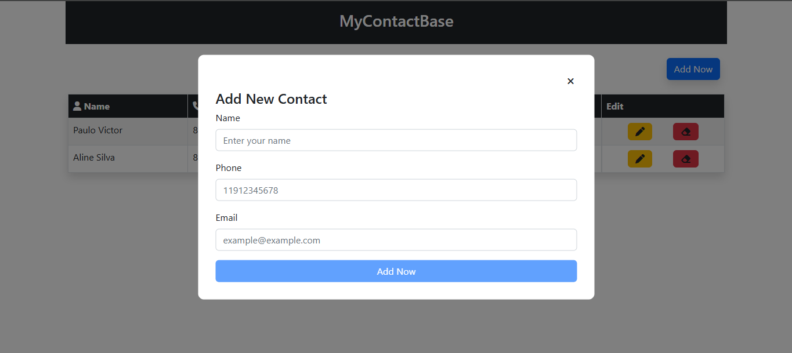
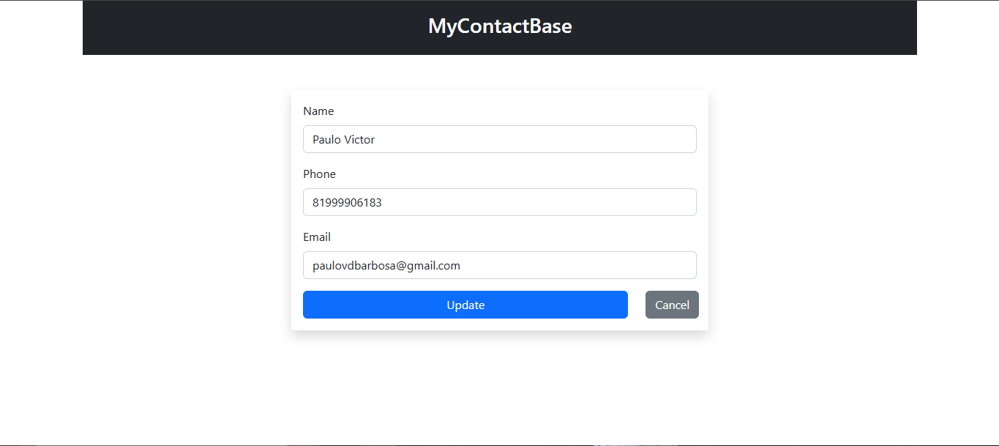
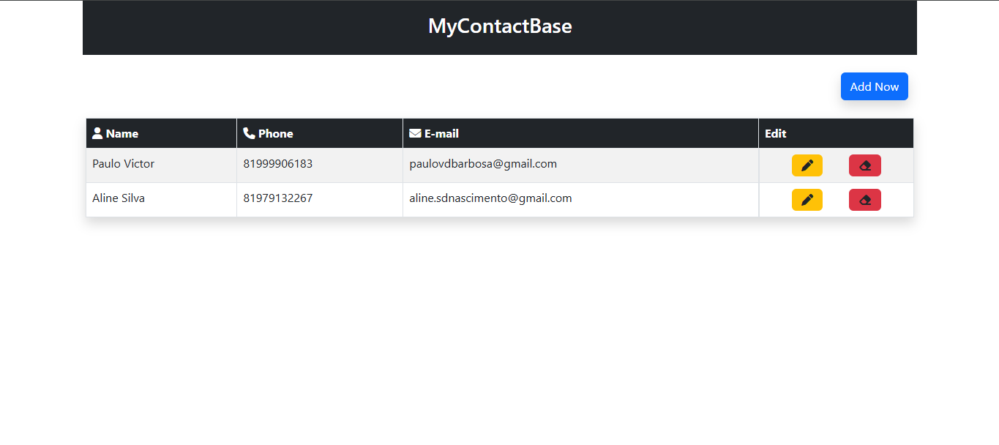

# MyContactBase

MyContactBase é um sistema simples de gerenciamento de contatos, desenvolvido em PHP com suporte a um banco de dados. Ele permite que usuários adicionem, editem, excluam e visualizem contatos de forma eficiente.

## Recursos

- **Adicionar Contatos**: Inclua novos contatos com informações essenciais.

*Adicionar contatos*
- **Editar Contatos**: Atualize os dados de contatos existentes.

*Editar contatos*
- **Excluir Contatos**: Remova contatos indesejados.
- **Visualização de Contatos**: Liste todos os contatos cadastrados em uma interface amigável.

*Página inicial*
-- **Banco de dados**

*Banco de dados*

## Tecnologias Utilizadas

- **PHP**: Linguagem principal para o back-end.
- **Bootstrap**: Framework CSS para estilização e responsividade.
- **MySQL**: Banco de dados para armazenamento de contatos.
- **HTML/CSS**: Estruturação e estilização da aplicação.

## Estrutura do Projeto

A estrutura do projeto é organizada para facilitar a manutenção e expansão:

```
MyContactBase/
├── index.php             # Página principal
├── server.php            # Conexão com o banco de dados
├── server_functions.php  # Funções auxiliares do servidor
├── assets/               # Arquivos CSS e JS
│   └── bootstrap/        # Bootstrap para estilização
├── inc/                  # Componentes e rotas
│   ├── adicionar.php     # Adiciona contatos
│   ├── delete.php        # Exclui contatos
│   ├── update.php        # Atualiza contatos
│   ├── header.php        # Cabeçalho da aplicação
│   └── footer.php        # Rodapé da aplicação
├── scripts/              # Scripts principais
│   ├── home.php          # Lógica da página inicial
│   └── edit.php          # Lógica de edição de contatos
└── README.md             # Documentação do projeto
```

## Configuração e Instalação

1. **Clone o Repositório**
   ```bash
   git clone https://github.com/seu-usuario/MyContactBase.git
   cd MyContactBase
   ```

2. **Configure o Banco de Dados**
   - Crie um banco de dados MySQL.
   - Importe o arquivo SQL de exemplo (caso fornecido).
   - Atualize as credenciais do banco de dados em `server.php`.

3. **Inicie o Servidor Local**
   Use o PHP embutido ou um servidor como XAMPP:
   ```bash
   php -S localhost:8000
   ```

4. **Acesse o Sistema**
   Abra o navegador e visite: `http://localhost:8000`

## Contribuição

Contribuições são bem-vindas! Sinta-se à vontade para abrir issues ou enviar pull requests.

## Licença

Este projeto está licenciado sob a [MIT License](LICENSE).

---

**MyContactBase** é um projeto simples, ideal para aprendizado e experimentação com PHP e bancos de dados. Agradecemos por usar ou contribuir!
